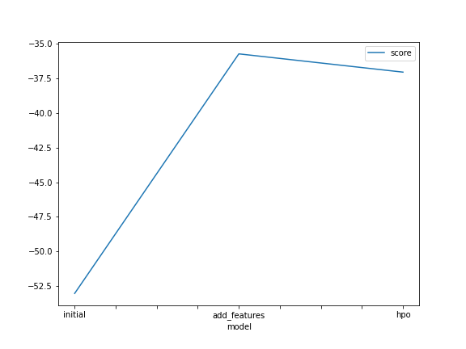
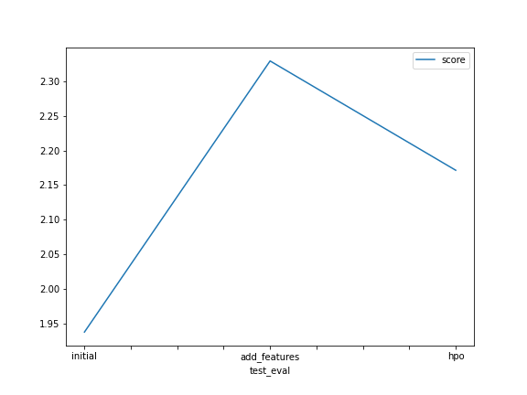

# Bike Sharing Demand Prediction with AutoGluon 🚴‍♂️📈

This project demonstrates the use of AutoGluon, an AutoML library, to predict bike sharing demand based on the Kaggle "Bike Sharing Demand" competition. The Jupyter Notebook provides a step-by-step walkthrough of the entire process, from data acquisition and preprocessing to model training, feature engineering, hyperparameter optimization, and finally, submitting predictions to Kaggle.

## 🌟 Project Highlights

*   **Automated Machine Learning:** Leverages AutoGluon's `TabularPredictor` to automatically train and ensemble various state-of-the-art models.
*   **Kaggle Competition:** Directly interacts with the Kaggle API to download datasets and submit predictions.
*   **Feature Engineering:** Demonstrates creating new features from datetime objects (year, month, day, hour) to improve model performance.
*   **Hyperparameter Optimization (HPO):** Shows how to use AutoGluon's HPO capabilities to fine-tune models for better accuracy.
*   **Reproducible Workflow:** The notebook is designed to be run sequentially, making the experiment easy to understand and reproduce.
*   **Performance Tracking:** Shows the difference in Kaggle scores through different stages of model development.

## 📂 Files in this Repository

*   `BikeShare Demand Prediction.ipynb`: The main Jupyter Notebook containing all the code and analysis.
*   `.gitignore`: Specifies files and directories to be ignored by Git (e.g., downloaded data, API keys, model artifacts).
*   `README.md`: This file, providing an overview and setup instructions.

**Note:** The dataset files (`train.csv`, `test.csv`, `sampleSubmission.csv`) and the `AutogluonModels/` directory are not included in this repository as they are downloaded/generated by the notebook.

## 🛠️ Getting Started

Follow these instructions to get a copy of the project up and running on your local machine for development and testing purposes.

### Prerequisites

*   Python 3.7+
*   pip (Python package installer)
*   A Kaggle Account and API Key:
    1.  Sign up for a Kaggle account at [kaggle.com](https://www.kaggle.com/).
    2.  Go to your account settings page (click on your profile picture, then "Account").
    3.  Scroll down to the "API" section and click "Create New API Token". This will download a `kaggle.json` file.

### Installation & Setup

1.  **Clone the repository:**
    ```bash
    git clone https://github.com/BinarySkull/bike-sharing-autogluon.git
    cd bike-sharing-autogluon
    ```

2.  **Set up your Kaggle API Key:**
    *   Open the `BikeShare Demand Prediction.ipynb` notebook.
    *   Locate the cell with the following Python code:
        ```python
        # Fill in your user name and key from creating the kaggle account and API token file
        import json
        kaggle_username = "skully" # REPLACE WITH YOUR KAGGLE USERNAME
        kaggle_key = ""        # REPLACE WITH YOUR KAGGLE KEY

        # Save API token the kaggle.json file
        # ... (rest of the cell) ...
        ```
    *   Replace `"skully"` with your Kaggle username and `""` with your Kaggle key (from the `kaggle.json` file you downloaded).
    *   **IMPORTANT:** The `kaggle.json` file itself is listed in `.gitignore` and should **NEVER** be committed to your repository if you place it in the project root manually. The notebook creates it in `/root/.kaggle/` or a similar user-specific hidden directory, which is a safer approach.

3.  **Install required Python libraries:**
    It's highly recommended to use a virtual environment.
    ```bash
    python -m venv env
    source env/bin/activate  # On Windows: env\Scripts\activate
    ```
    Then, install the packages (the notebook also has a cell for this, but pre-installing can be smoother):
    ```bash
    pip install -U pip setuptools wheel
    pip install pandas autogluon "mxnet<2.0.0" bokeh==2.0.1 kaggle matplotlib
    ```
    *(Note: The notebook installs `autogluon` with `--no-cache-dir` which is good for resource-constrained environments like SageMaker Studio's default instances.)*

### Running the Notebook

1.  Ensure your Kaggle API key is correctly set in the notebook cell as described above.
2.  Launch Jupyter Lab or Jupyter Notebook:
    ```bash
    jupyter lab
    # or
    jupyter notebook
    ```
3.  Open `BikeShare Demand Prediction.ipynb`.
4.  Run the cells sequentially. The notebook will:
    *   Install/update packages (if you haven't already).
    *   Configure the Kaggle API.
    *   Download the "Bike Sharing Demand" dataset.
    *   Preprocess data and train an initial AutoGluon model.
    *   Perform Exploratory Data Analysis (EDA) and create new datetime features.
    *   Retrain the model with these new features.
    *   Perform Hyperparameter Optimization (HPO).
    *   Generate submission files and (optionally) submit them to Kaggle to see what you score.

## 📝 Notebook Workflow Overview

The notebook is structured as follows:

1.  **Step 1 & 2: Kaggle Setup & Data Download:**
    *   Installs necessary packages.
    *   Sets up the Kaggle API key.
    *   Downloads the "Bike Sharing Demand" competition data (`train.csv`, `test.csv`, `sampleSubmission.csv`).
    *   Loads the data into pandas DataFrames.

2.  **Step 3: Initial Model Training with AutoGluon:**
    *   Uses `TabularPredictor` with default settings (`presets="best_quality"`, 10-minute time limit).
    *   Predicts the `count` label.
    *   Reviews model performance and creates an initial Kaggle submission.

3.  **Step 4: Exploratory Data Analysis & Feature Engineering:**
    *   Visualizes feature distributions using `train.hist()`.
    *   Extracts `year`, `month`, `day`, and `hour` from the `datetime` column.
    *   Converts `season` and `weather` to categorical types.

4.  **Step 5: Retraining with New Features:**
    *   Retrains AutoGluon `TabularPredictor` using the augmented dataset.
    *   Generates a new submission file.

5.  **Step 6: Hyperparameter Optimization (HPO):**
    *   Defines a hyperparameter search space for selected models (e.g., GBM, XGB).
    *   Runs AutoGluon with `hyperparameter_tune_kwargs='auto'` and an extended time limit.
    *   Creates a final submission file.

6.  **Step 7: Results & Reporting:**
    *   Tracks Kaggle scores after each major step.
    *   Presents a summary table and plots showing performance improvements.

## 📊 Results Summary

The project aims to improve the prediction score on the Kaggle "Bike Sharing Demand" competition (evaluated by Root Mean Squared Log Error, but AutoGluon uses RMSE for regression by default, which is fine). The notebook demonstrates how feature engineering and HPO can lead to different model performance.

| Model Stage                      | Kaggle Public Score (Example) | Notes                                               |
| :------------------------------- | :---------------------------- | :-------------------------------------------------- |
| Initial Model                    | `1.93791`                     | AutoGluon with default features.                    |
| Model with Additional Features   | `2.32921`                     | Added year, month, day, hour features.              |
| Model with HPO & New Features    | `2.17146`                     | Hyperparameter optimization applied.                |
*(Scores are indicative and taken from the example notebook output. Your actual scores may vary.)*

### Model Performance Plots

**Training Score Progression:**


**Kaggle Test Score Progression:**


## 💡 Potential Enhancements

*   Explore more advanced feature engineering (e.g., interactions, lagging features for time series aspects).
*   Experiment with different AutoGluon presets or custom model configurations.
*   Try different HPO strategies or search spaces.
*   Integrate more sophisticated time-series specific modeling if appropriate for the competition's later stages.

## ☁️ SageMaker Studio Context

This notebook was developed within AWS SageMaker Studio, using:
*   Instance: `ml.t3.medium` (2 vCPU + 4 GiB)
*   Kernel: `Python 3 (MXNet 1.8 Python 3.7 CPU Optimized)`

While it can run locally, this context is useful if you wish to replicate the exact environment.

## 📜 License

This project is open source. Feel free to use and adapt the code.

---

Happy modeling! Feel free to open an issue or pull request if you have suggestions or improvements.
